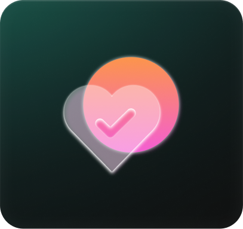
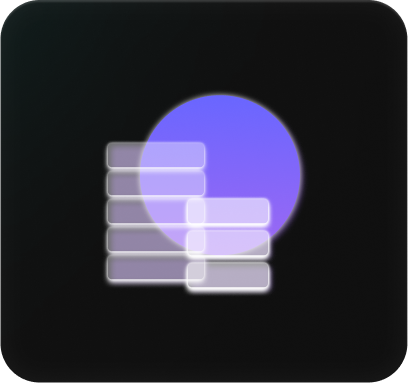
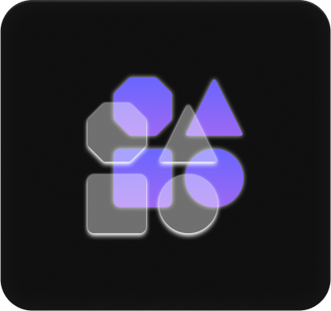

## Definisi UI/UX

### UI (User Interface)

Antar muka pengguna, termasuk elemen visual seperti tata letak, warna, dan ikon.

### UX (User Experience)

Pengalaman yang dirasakan oleh pengguna saat berinteraksi dengan produk.

## Maksud UI/UX

- Memaksimalkan kepuasan pengguna
- Meningkatkan efisiensi penggunaan
- Menghasilkan desain yang estetis dan fungsional.

## Role dalam UI/UX

- UI Designer: Bertanggung jawab untuk tampilan visual dan estetika produk.

- UX Designer: Fokus pada pengalaman pengguna, penelitian, dan pembuatan
  prototipe.

- Interaction Designer: Bertanggung jawab untuk mendesain interaksi antara
  pengguna dan antarmuka produk.

- Visual Designer: Fokus pada aspek visual dalam desain UI/UX. Mereka bekerja
  dengan desainer UI dan desainer UX untuk menghasilkan antarmuka yang menarik
  dan konsisten

## Tujuan UI/UX

- Membuat produk yang mudah digunakan dan menarik
- Meningkatkan tingkat retensi pengguna
- Menciptakan pengalaman yang konsisten dan intuitif

## Proses Design Thinking

| Empathize                         | Define                    | Ideate                    | Prototype                       | Testing                     |
| --------------------------------- | ------------------------- | ------------------------- | ------------------------------- | --------------------------- |
|    |  |  |  |  |
| Pemahaman empatik tentang masalah | Mengumpulkan informasi    | Menghasilkan ide          |                                 |                             |

## Tools UI/UX

### Whimsical

https://whimsical.com/

### Figma

https://www.figma.com/
