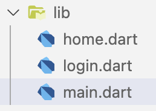

- Navigasi Multi Page
- Card Widget
- Textfield
- inkWell
- AppBar

## Navigasi Multi Page

Buat 2 file dengan menggunakan StatelessWidget bernama home.dart dan login.dart
pada folder lib :



Pada home.dart kita akan memanggil

```dart {linenos=table,hl_lines=[7],linenostart=1}
class MainApp extends StatelessWidget {
  const MainApp({super.key});

  @override
  Widget build(BuildContext context) {
    return const MaterialApp(
      home: LoginPage(),
    );
  }
}
```

Pada login page, kita menggunakan widget Navigator seperti pada baris 17 dan
kita memanggil homepage di dalam MaterialPageRoute seperti pada baris ke 21.

```dart {linenos=table,hl_lines=[16,17,21],linenostart=1}
class LoginPage extends StatelessWidget {
  const LoginPage({super.key});

  @override
  Widget build(BuildContext context) {
    return Scaffold(
      appBar: AppBar(
        title: const Text("Berkah IT"),
      ),
      body: Center(
        child: Column(
          mainAxisAlignment: MainAxisAlignment.center,
          children: [
            const Text("Ini halaman login"),
            ElevatedButton(
              onPressed: () {
                Navigator.push(
                  context,
                  MaterialPageRoute(
                    builder: (context) {
                      return const HomePage();
                    },
                  ),
                );
              },
              child: const Text("Login"),
            ),
          ],
        ),
      ),
    );
  }
}
```

Pada home page, kita menggunakan widget Navigator seperti pada baris 17 dan kita
memanggil homepage di dalam MaterialPageRoute seperti pada baris ke 21.

```dart {linenos=table,hl_lines=[16,17,21],linenostart=1}
class HomePage extends StatelessWidget {
  const HomePage({super.key});

  @override
  Widget build(BuildContext context) {
    return Scaffold(
      appBar: AppBar(
        title: const Text("Berkah IT"),
      ),
      body: Center(
        child: Column(
          mainAxisAlignment: MainAxisAlignment.center,
          children: [
            const Text("Ini halaman Home"),
            ElevatedButton(
              onPressed: () {
                Navigator.pushReplacement(
                  context,
                  MaterialPageRoute(
                    builder: (context) {
                      return const LoginPage();
                    },
                  ),
                );
              },
              child: const Text("Logout"),
            ),
          ],
        ),
      ),
    );
  }
}
```

## Card

Widget card memiliki ukuran sesuai dengan isi contentnnya.

Parameter widget card :

| Parameter   | Fungsi                                                                                                                                                                   |
| ----------- | ------------------------------------------------------------------------------------------------------------------------------------------------------------------------ |
| color       | untuk memberikan background warna pada card                                                                                                                              |
| shape       | untuk mengatur bentuk dari border pada card. Disini kita menggunakan widget RoundedRectangleBorder dan memberikan BorderRadius Circular untuk memberikan efek melengkung |
| shadowColor | untuk mengatur warna shadow dari card                                                                                                                                    |
| elevation   | untuk mengatur size shadow dari card                                                                                                                                     |

```dart {linenos=table,hl_lines=[3,4,7,8],linenostart=1}
body: Center(
    child: Card(
        color: Colors.amber,
        shape: RoundedRectangleBorder(
            borderRadius: BorderRadius.circular(10),
        ),
        shadowColor: Colors.red,
        elevation: 10,
        child: const Padding(
            padding: EdgeInsets.all(100),
            child: Text("Ini card"),
            ),
        ),
    ),

```

## Textfield

```dart {linenos=table,hl_lines=["3-5","10-12","16-18"],linenostart=1}
body: Center(
  child: TextField(
    inputFormatters: [FilteringTextInputFormatter.digitsOnly],
    keyboardType: TextInputType.number,
    style: const TextStyle(
      fontSize: 18,
      fontWeight: FontWeight.w600,
      color: Colors.black,
    ),
    decoration: const InputDecoration(
      focusedBorder: OutlineInputBorder(
        borderSide: BorderSide(
          color: Colors.amber,
        ),
      ),
      border: OutlineInputBorder(),
      contentPadding: EdgeInsets.all(13),
      prefix: Icon(Icons.lock),
      ),
    ),
  ),
```

## Inkwell

```dart
body: Center(
  child: InkWell(
    borderRadius: BorderRadius.circular(3),
    splashColor: Colors.amber,
    highlightColor: Colors.white70,
    onTap: () {},
    child: Padding(
      padding: EdgeInsets.all(8.0),
      child: Text("ini inkwell"),
    ),
  ),
),
```

## AppBar

```dart
appBar: AppBar(
  title: const Text(
    "Berkah IT",
    style: TextStyle(
      color: Colors.white,
      fontWeight: FontWeight.w600,
      fontSize: 18,
    ),
  ),
  leading: IconButton(
    icon: const Icon(Icons.arrow_back_ios_new_outlined),
    iconSize: 22,
    color: Colors.white,
    onPressed: () {},
  ),
  elevation: 0,
  centerTitle: true,
  backgroundColor: Colors.amber,
),
```
