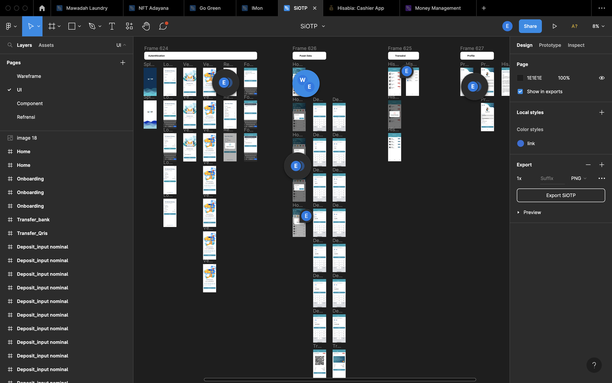
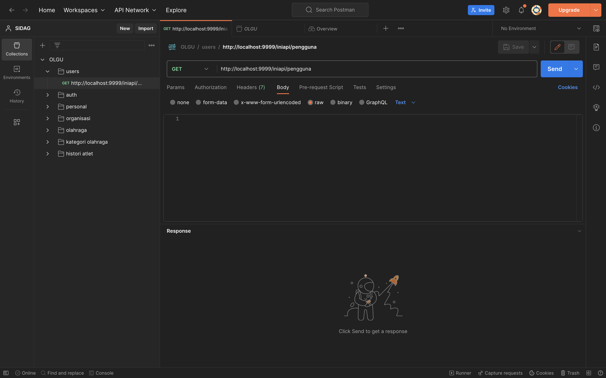
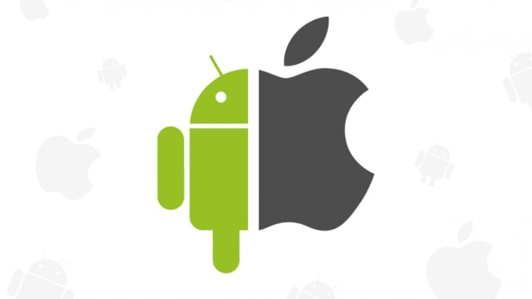

## Pengenalan

Apa itu mobile developer? aplikasi mobile? Dart? Flutter? API?

## Mobile Developer

Sebuah pekerjaan yang membuat aplikasi mobile berbasis android atau ios.
Pekerjaan utama seorang mobile developer ada 2 :

### Slicing UI

Proses untuk mengimplementasikan rancangan design ke codingan.

### Consume API

Mengkonsumsi atau mengolah data yang di sediakan oleh backend.

## Aplikasi Mobile

Aplikasi mobile umumnya berbasis android & ios, online maupun offline.

### Penyimpanan data

Menggunakan layanan cloud:

- Firebase
- Server (API)

Menggunakan penyimpanan internal:

- SQLite & SQFlite

## Dart

Bahasa pemrograman yang dikembangkan oleh google. Systanksnya mirip seperti java
bebasis OOP

## Flutter

Framework untuk membuat aplikasi mobile. Platform yang dapat dibuat oleh flutter
:

- Android
- IOS
- Web
- Desktop

## Install tools

### Flutter

https://flutter.dev/

### Android Studio

https://developer.android.com/studio

### Visual Studio Code

https://code.visualstudio.com/

## Tempat belajar dart & Flutter

- Erico Darmawan Handoyo
- Programmer Zaman Now
- Flutter
- Documentasi Flutter
- Chat GPT
- Berkah IT
- https://icourse.berkahit.com/

## Kolaborasi

- LinkedIn
- Github
- Notion
- Discord
