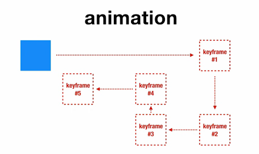

## CSS 3

Generasi ke-3 dari dari spesifikasi css


Topik yang akan di bahas :

- Font Face
- Transform
- Transition
- Animation
- Flexbox

## Font Face

```html
font-family: "Arial Narrow", arial, sans-serif;
```

Kita juga bisa menggunakan font dari google

https://fonts.google.com

Menggunakan Teknik @font-face


https://www.fontsquirrel.com/

## Transform

Memungkinkan kita dapat memanipulasi format visual (ukuran, bentuk, atau posisi)
dari elemen HTML

```html
transform: < fungsi >
```

Fungsi transform

- Scale => memberpesar / memperkecil
- Rotate => memutar
- Skew => membuat condong miring
- Translate => mengubah posisi

## Transition

Memungkinkan kita dapat mengubah nilai dari property HTLM secara halus

transition vs animation

### transition

Transition hanya mempunyai 2 keadaan yaitu keadaan awal dan keadaan akhir,
sedangkan animation bisa lebih

```html
transition: < durasi > [fungsi] [delay];
```


## Animation




### Iteration Count

```css
<angka> | infinite
```

### Direction

```css
normal | reverse | alternate | alternate-reverse
```

### Fill-mode

```css
none | forwards | backwards | both
```

### Play-state

```css
running | paused
```

## Flexbox

Digunakan untuk memudahkan kita mengatur layout.


Sebuah modul layout yang dapat mengatur jarak dan penjajaran antar item adalam
sebuah container.

### Display

```css
.container {
  display: flex;
}
```

Membuat sebuah elemen parent menjadi sebuah flexbox dan membuat elemen-elemen di
dalamnya bisa berperilaku flex juga

### Flex-direction


```css
.container {
  flex-direction: row | row-reverse | column | column-reverse;
}
```

### Flex-direction


```css
.container {
  flex-wrap: nowrap | wrap | wrap-reverse;
}
```

### Justify Content


### Align Items


