## Intro

Teknik css untuk mengatur dan meletakkan atau memposisikan elemen-elemen html
yang sudah kita buat menggunakan syntak css, seperti ukuran, posisi, ataupun
perilaku dari element-element html tersebut

- Display
- Dimensi & Overflow
- Box-model
- Float
- Position

## Display

Setiap tag html memiliki nilai default untuk properti display. Tetapi kita juga
dapat mengubah perilaku tag tersebut dengan mengganti valuenya.

- inline
- inline-block
- block
- none

### Inline

- Element HTML yang secara default tidak menambahkan baris baru ketika dibuat
- Lebar dan Tinggi elemennya sebesar isi kontennya dan tidak dapat diatur.
- Margin dan padding hanya mempengaruhi element secara horizontal, tidak
  vertikal

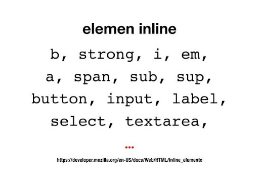

### Inline-block

- Tidak ada element yang secara default memiliki display inline-block;
- Perilaku dasarnya sama dengan inline
- Perbedaannya kita bisa atur tinggi dan lebar elemennya.

### Block

- Element HTML yang secara default menambahkan baris baru ketika dibuat
- Lebar elemennya secara default akan memenuhi lebar browser/parennya
- Kita dapat mengatur lebar dan tinggi elemenya
- Kita dapat menyimpan/membungkus element inline, inline-block atau bahkan
  elemen block lagi.

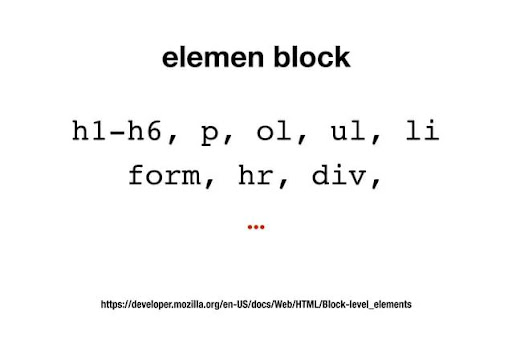

### None

Digunakan untuk menghilangkan element

## Dimensi & Overflow

### Dimensi

Terdiri dari :

- width
- heigth

width & heigth memiliki beberapa komponen :
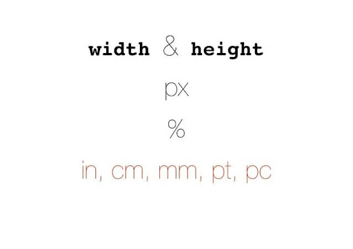

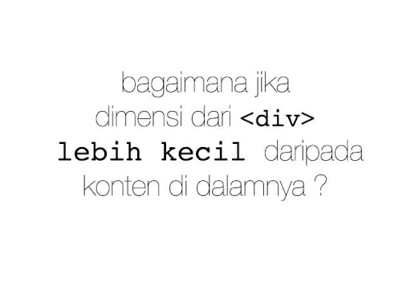

### Overflow

Ada 4 value overflow :

- visible
- auto
- hidden
- scroll

## Box Model

- Box-model mendefinsikan ‘kotak’ yang dihasilkan oleh sebuah elemen, lalu
  menampilkannya sesuai dengan format visualnya

- Setiap elemen HTML berada dalam sebuah box (kotak)

- Box-model terdiri dari margin, border, padding dan content

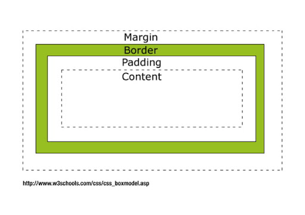

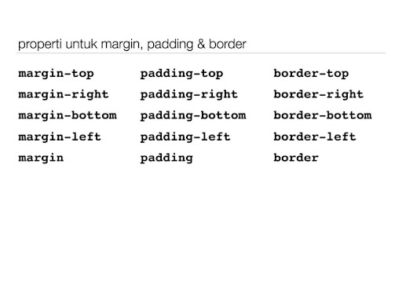

| Margin                    | Padding                     | Border                    |
| ------------------------- | --------------------------- | ------------------------- |
| 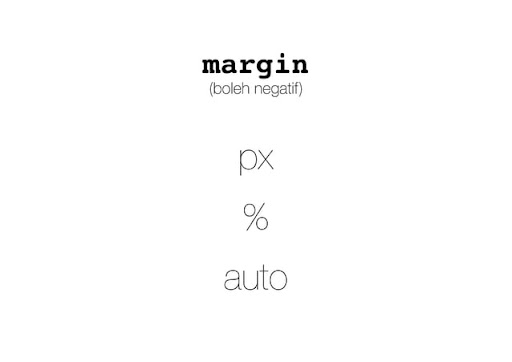 | 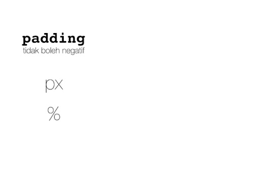 | 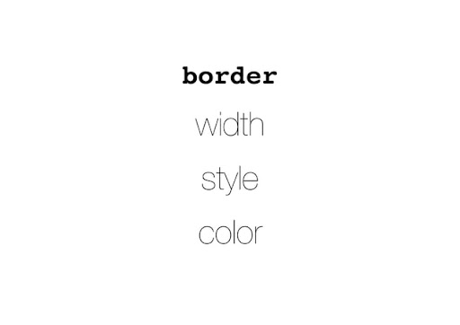 |
|                           |                             |                           |

```html
border: width style color;
```

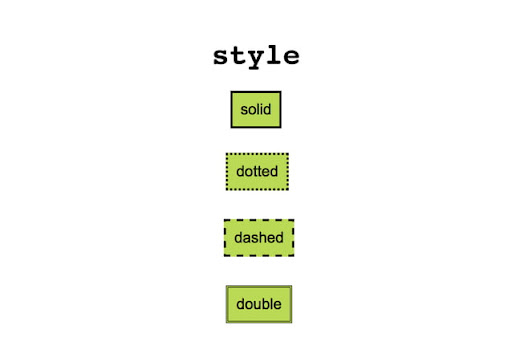

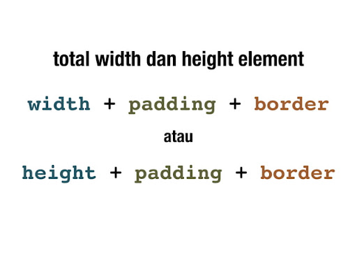

Box-sizing

Box-sizing : border-box;

## Float

Merupakan property css untuk mengatur posisi sebuah elemen. Sebuah elemen dapat
dipaksa berada pada kanan/kiri dari paren/pembungkusnya dengan property ini

- none
- left
- right

Yang bisa dilakukan dengan float :

- text wrapping : membuat teks mengelilingi gambar / elemen lain
- image gallery : membuat serangkaian gambar menjadi galeri
- multi-column layout : membuat halaman memiliki beberapa kolom
- dan masih banyak lagi

Masalah pada float? Solusinya CSS clear

```html
clear
```

clear berfungsi menghentikan / membersihkan float

- left
- right
- both

## Position

- Static
- Relative
- Absolute
- Fixed

### Static

- static adalah nilai default dari tiap-tiap elemen ketika tidak diberi properti
  position

- mengunakan position selain static (non-static), akan membuat sebuah elemen
  menjadi seolah-olah berbeda dimensi dari elemen lainnya

- elemen yang diberi position selain dtatic dapat menggunakan properti top,left
  bottom dan right untuk mengatur posisinya

### Relative

- Ketika kita menggerakkan elemen dengan posisi relative (menggunakan properti
  top,left,bottom dan right), ruang yang ditempati oleh elemen tersebut masih
  ada

- Ketika kita menggerakka elemen dengan posisi relative, elemen akan bergerak
  relatif terhadap posisi semula-nya

- jika kita memberi properti top: 0; dan left: 0; maka elemen tidak berubah
  posisinya

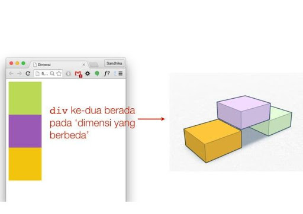

### Absolute

- Ketika kita menggerakan elemen dengan posisi absolute (menggunakan properti
  top,left,bottom dan right), ruang yang ditempati oleh lemen tersebut dianggap
  tidak ada

- Ketika kita menggerakkan elemen dengan posisi absolute, elemen akan bergerak
  relatif terhadap posisi dari elemen parent-nya, selama elemen parent-nya
  memiliki posisi yang juga non-static

- Jika kita memberi properti top: 0; dan left: 0; maka elemen akan berada di
  ujung kiri atas dari elemen parent-nya

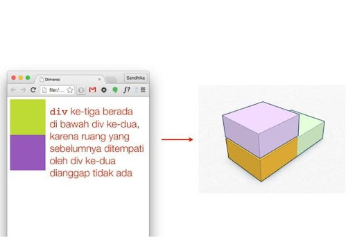

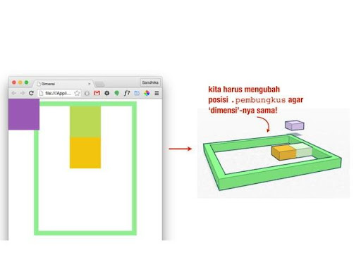

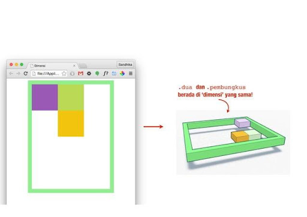

### Fixed

- ketika kita menggerakkan elemen dengan psisi fixed (menggunakan properti
  top,left,bottom dan right), ruang yang ditempati oleh lemen tersebut dianggap
  tidak ada

- ketika kita menggerakkan elemen dengan posisi absolute, elemen akan bergerak
  relatif terhadap window (browser), meskipun elemen parent-nya bernilai
  non-static

- Jika kita memberi properti top: 0; dan left: 0; maka elemen akan berada di
  ujung kiri atas dari elemen parent-nya

- elemen akan 'terkunci' dan tidak bergerak dari posisinya meskipun halaman
  di-scroll
