## Pengenalan CSS

- Bahasa yang digunakan untuk menentukan tampilan dan gaya elemen-elemen pada
  halaman web.
- CSS bukan bahasa pemrograman

## Jenis-jenis CSS

- Inline CSS
- Internal CSS
- Eksternal CSS

## Anatomi CSS

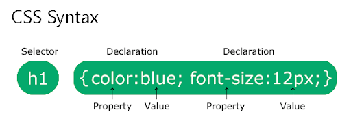

## Selector

### Selector sederhana

Memilih element berdasarkan tag, id, kelas dan universal

|                                  |                                  |                                  |
| -------------------------------- | -------------------------------- | -------------------------------- |
| 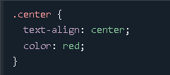 | 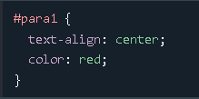 | 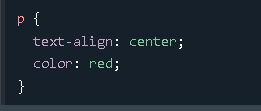 |
| 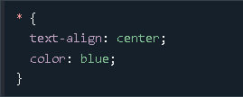 | 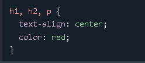 |                                  |
|                                  |                                  |                                  |

### Selector Combinator

#### Descendant

Descendant selector (spasi) => pemilihan secara keturunan
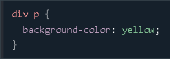

#### Child

Child selector (>) => pemilihan elemen yang merupakan anak dari element tertentu
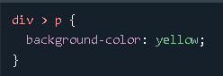

#### Adjacent Sibling

Adjacent Sibling Selector (+) => pemilihan berdasarkan saudara element terdekat
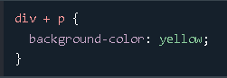

#### General Sibling

General Sibling Selector (~) => pemilihan berdasarkan saudara element berikutnya
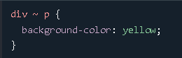

### Selector Attribute

Dimungkinkan untuk menata elemen HTML yang memiliki atribut atau nilai atribut
tertentu.

|                                                   |                                                  |
| ------------------------------------------------- | ------------------------------------------------ |
| 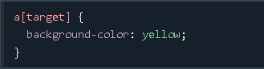 | 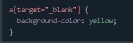 |
|                                                   |                                                  |

## Psuedo-class

Kelas semu yang dimiliki oleh element html, yang membuat kita dapat
mengimplementasikan style pada Keadaan tertentu dari elemen tersebut

### Psuedo-class yang berhubungan dengan link

#### :link

style default pada sebuah link (a yang memiliki href)

#### :hover

Style Ketika kursor mouse berada di atas elemen

#### :active

style Ketika sebuah link di-klik

#### :visited

style Ketika sebuah link sudah pernah dikunjungi (mengguanakaan browser yang
sama)

### Psuedo-class yang berhubungan dengan posisi element

#### :first-child

Memilih elemen pertama dari sebuah parent (elemen pembungkusnya)

#### :last-child

Memilih elemen terakhir dari sebuah parent

#### :nth-child(n)

memilih element ke-n dari sebuah parent, dimana n bisa (1), (2)…..atau bisa
menggunakan pola (2n), (3n+1) atau (odd) dan (even)

## Specificity CSS

Setiap deklarasi css (selector) memiliki berat yang berbeda. Berat tersebut
menentukan seberapa spesifik elemen yang dipilih oleh selector

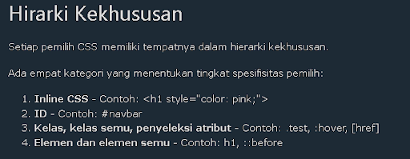
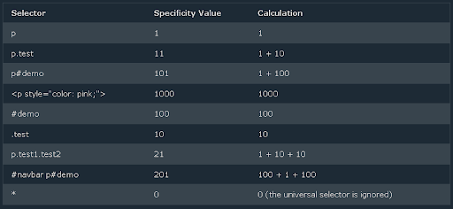
