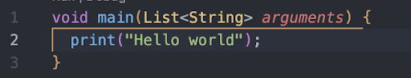
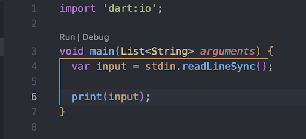
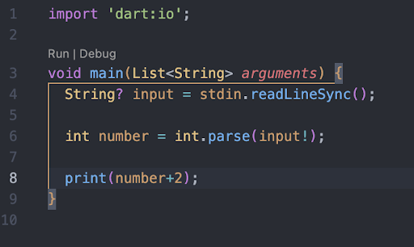
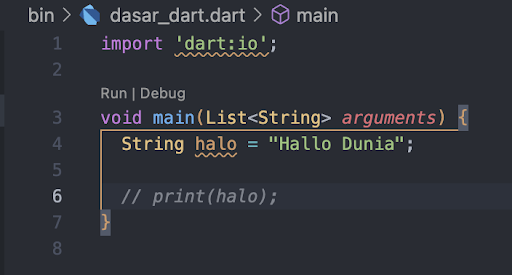
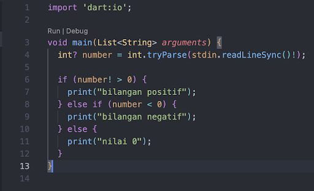
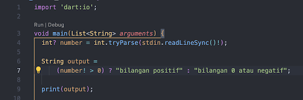
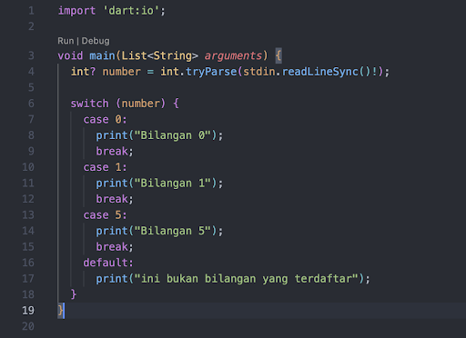
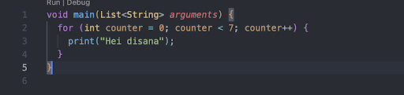
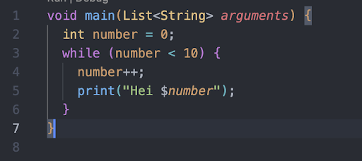

## Dasar-dasar dart

- Print
- Input inline
- Null safety
- Variable
- Komentar
- Perkondisian
- Perulangan

## Print

Hello World in Dart

## Input inline

Input text in terminal

## Null Safety

Null Safety ditandai dengan "?" dan "!"

## Variable

TypeData NamaVariable = Nilai;

## Komentar

//

## Perkondisian

### if else

### Ternary Operator

### switch

## Perulangan

### for

### while

