## Dasar Dart Lanjutan

- Perulangan
- Function
- List

## Perulangan

### for

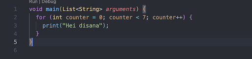

### while

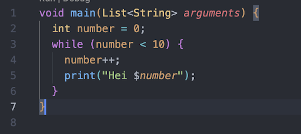

## Function

| Mengembalikan Nilai            | Tidak Mengembalikan Nilai        |
| ------------------------------ | -------------------------------- |
| 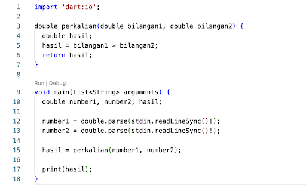 | 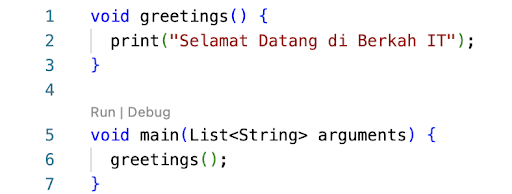 |
|                                |                                  |

### Optional Parameter

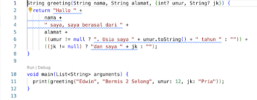

### Positional Paramter

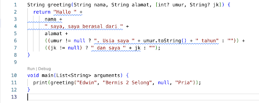

### Default Value

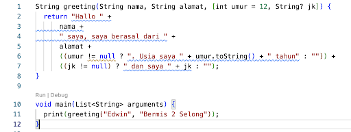

## List

List < TypeData > NamaVariable = [ Nilai ];

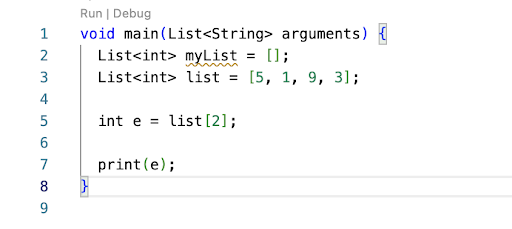

### Mengeluarkan Nilai

|                                         |                                        |                                        |
| --------------------------------------- | -------------------------------------- | -------------------------------------- |
| 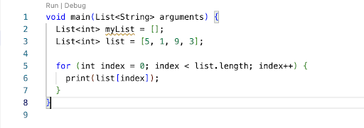 | 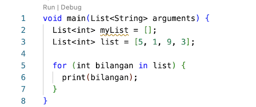 | 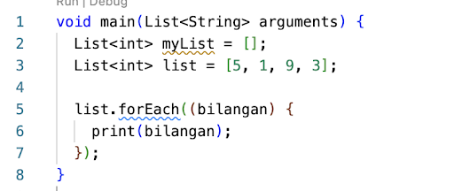 |
|                                         |                                        |                                        |

### Dasar List

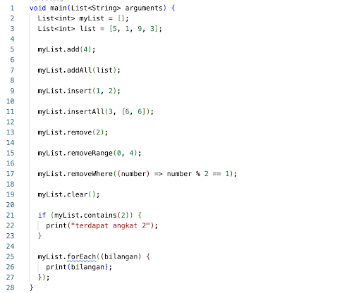

### List Map

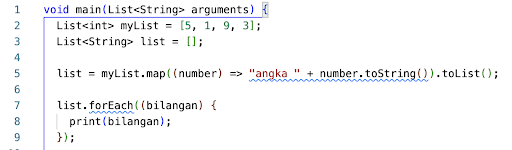
