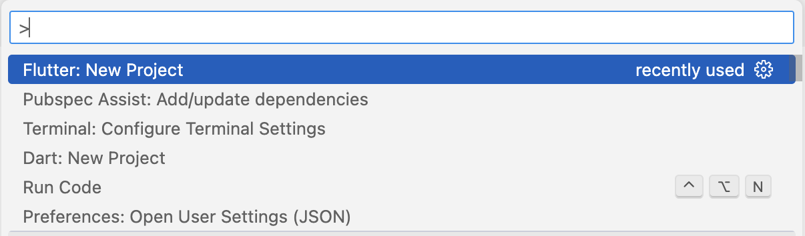
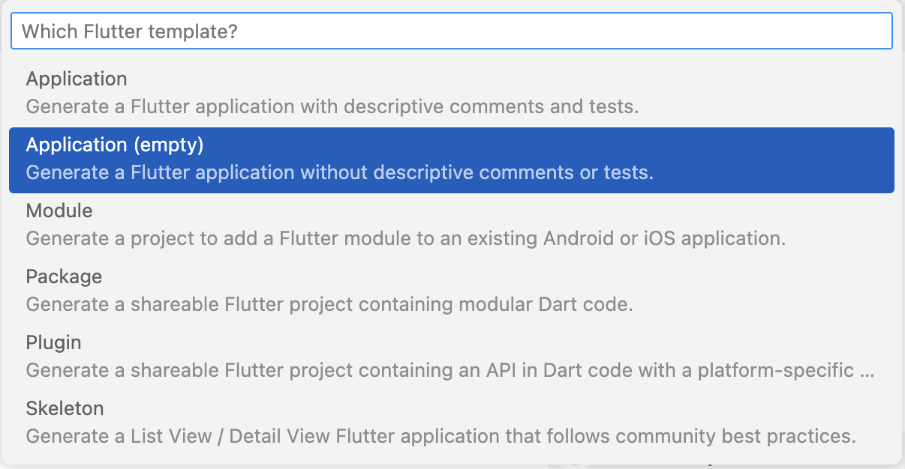
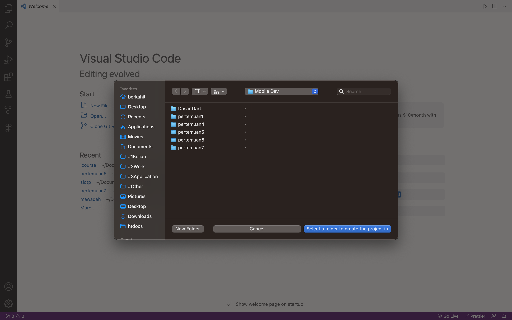
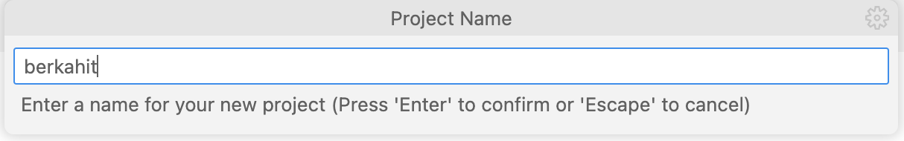
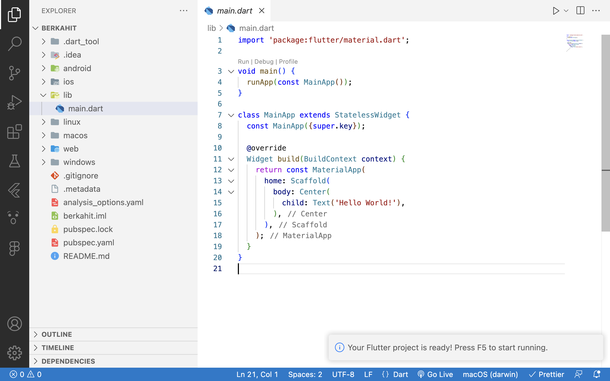

## Flutter

- Apa itu flutter?
- Widget
- Material Design & Cupertino Design
- Membuat aplikasi flutter pertama

## Apa itu Flutter?

SDK (Software Development Kit) yang di buat oleh Google.

Flutter dapat membuat aplikasi berbasis :

- Mobile (Android & IOS)
- Web
- Desktop

## Widget

Implementasi dari dunia nyata.

Contoh seperti Rak dan Buku. Yang dimana Rak (widget) dapat menampung
buku(widget).

## Material Design & Cupertino Design

### Material Design

Tampilan untuk Android

Metafora dari dunia nyata :

- bayangan
- teksture
- cahaya

https://m3.material.io/

### Cupertino Design

Tampilan untuk IOS

https://docs.flutter.dev/ui/widgets/cupertino

## Membuat aplikasi flutter pertama

Klik

```
ctrl + shift + p
```











## Shortcut keyboard

| shortcut         | ket                                                            |
| ---------------- | -------------------------------------------------------------- |
| ctrl + space     | menampilakan argumen atau parameter yang bisa di pakai         |
| ctrl + shift + R | membungkus dan mengekstrak widget menjadi method atau function |
| ctrl + shift + p | membuat project baru                                           |

## fitur flutter

| fitur      | ket                                 |
| ---------- | ----------------------------------- |
| hot reload | refresh yang sedang dicoding        |
| restart    | refresh semua file (semua codingan) |
