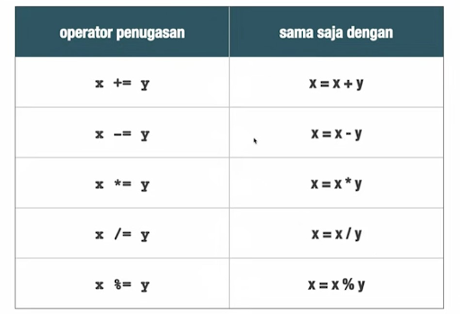
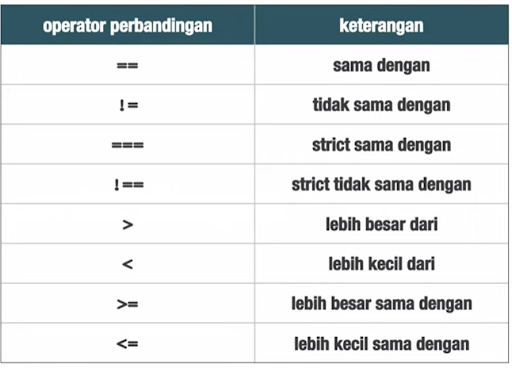
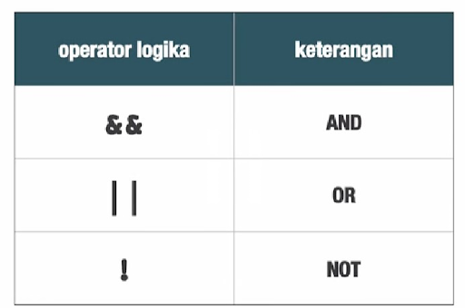

> “ JavaScript is a High-level, scripting, untyped, and interpreted programming
> language. “

## Type Data

```js
Number      :	23, -5, 3.12, NaN, Infinity
String      :	“hello”, ‘world’, `word`
Boolean     :	true dan false
Object      :	{ properti: ‘value },
Function    :	function (a, b) {}
Undefined

```

## Operator

Sebuah symbol yang digunakan untuk melakukan operasi

- Binary (sebuah operator yang membutuhkan 2 operand)
- Aritmatika
- Penugasan
- Perbandingan
- Logika
- String
- Ternary (sebuah operator yang membutuhkan 3 operand)
- Kondisional
- Unary (sebuah operator yang membutuhkan 1 operand)
- typeof

### Aritmatika

```js
( + , - , * , / , % )
```

### Penugasan

```js
 ( = ,  += ,  /= , -= , *= , %= )

```



### Perbandingan



### Logika



### String

```js
+

"Hello" + "World = "Hello World";
```

### Typeof

Digunakan untuk mengetahui tipe data

```js
typeof operand;
```

### Kondisional

```js
kondisi ? benar : salah;
```

## Variable

Sebuah tempat yang memiliki nama, yang fungsinya untuk menampung/menyimpan nilai

```js
Declarasi, Inisialisasi, Assignment;
var x; // declarasi dan inisialisasi
x = 10;	// assignment
var, let, dan const
```

## Menulis javascript

```js
<script></script>;
Internal & eksternal;
```

## Popup box

```js
Alert, prompt, dan confirm

```

## Pengulagan

- while
- for
- do while

### While

```js
while (kondisi) {
  aksi;
}
```

### For

```js
for (declarasi; kondisi; increment / decrement) {
  aksi;
}

for (var i = 10; i <= 10; i++) {
  aksi;
}
```

## Perkondisian

### If else

```js
if (kondisi) {
  aksi;
}

var angka = 3;
if (angka % 2 == 0) {
  console.log(angka + ‘ bilangan genap’)
}    else  {
   console.log(angka + ‘ bilangan ganjil’)
}

( ELSE IF )
nilai >= 85 ==  A
nilai antara 76 dan 84  ==  B
nilai dibawah 76 == C

var nilai = 90;
if (nilai >= 85) {
  console.log(‘A’’)
} else if (nilai >= 76 && nilai <= 84) {
  console.log(“B’’)
} else {
  console.log(“C”)
}

```

### Switch

```js
Switch (kondisi) {
     case 1:
	aksi
	break;
     case 2:
	aksi
	 break;
      default:
	aksi default
	 break;
}

```

## Function

Sebuah sub-program yang dapat di panggil di bagian lain pada program

Kenapa menggunakan function ?

- Reusability (tidak mengulang-ulang script)
- Dekomposisi / Abstraksi
- Modularitas

Kategori function

- Built-in Function (cth: alert(), prompt(), confirm())
- User-Defined Function

## User-Defined Function

```js
function name(parameter) {
  aksi;
  return;
}

function penjumlahan(a, b) {
  var hasil = a + b;
  return hasil;
}

Console.log(penjumlahan(5, 10));
Console.log(penjumlahan(100, 200));
```

Jenis Function

- Declaration
- Expression

### Function Declaration

- Lebih fleksibel (dapat ditulis dimanapun)

```js
tampilPesan(“windi”);

function tampilPesan (nama) {
    alert(‘halo ’+nama)
}
```

### Function Expression

- Harus didefinisikan terlebih dahulu baru bisa di panggil
- Lebih powerfull

```js
var tampilPesan = function (nama) {
   alert(‘halo ‘ + nama)
}

tampilPesan (‘windi’)
```
