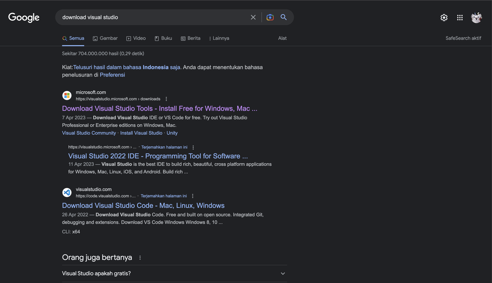
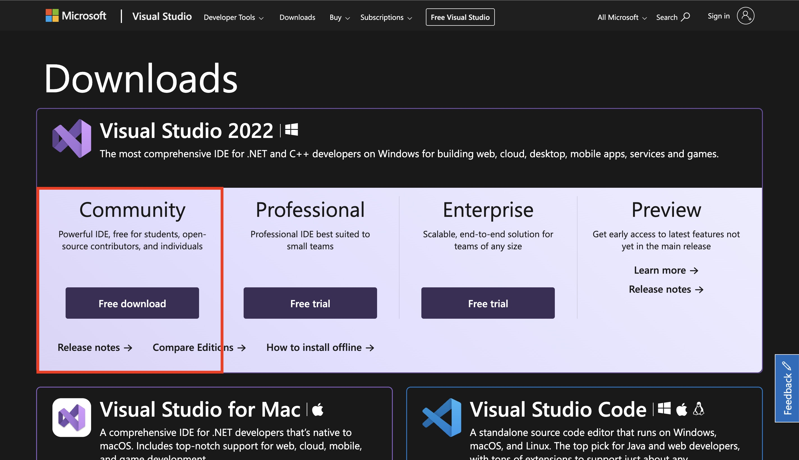
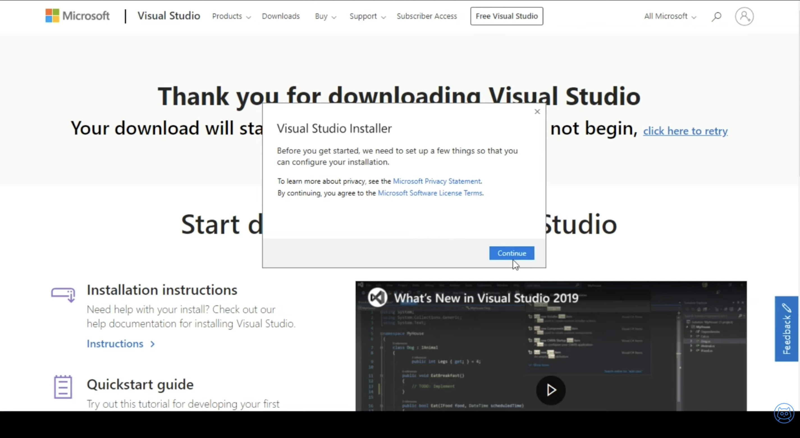
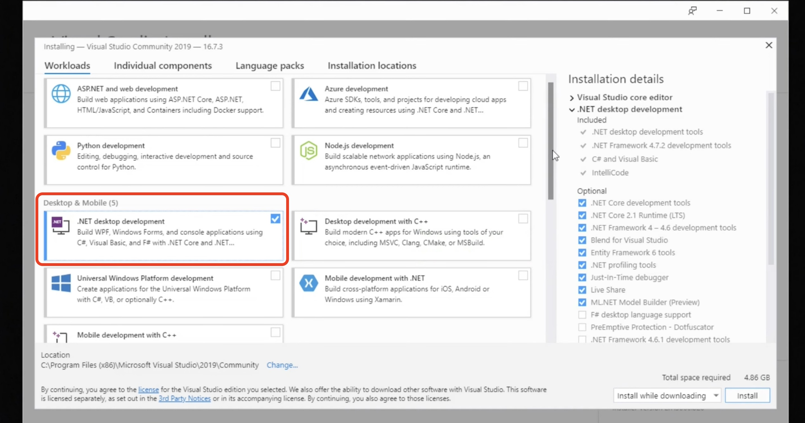
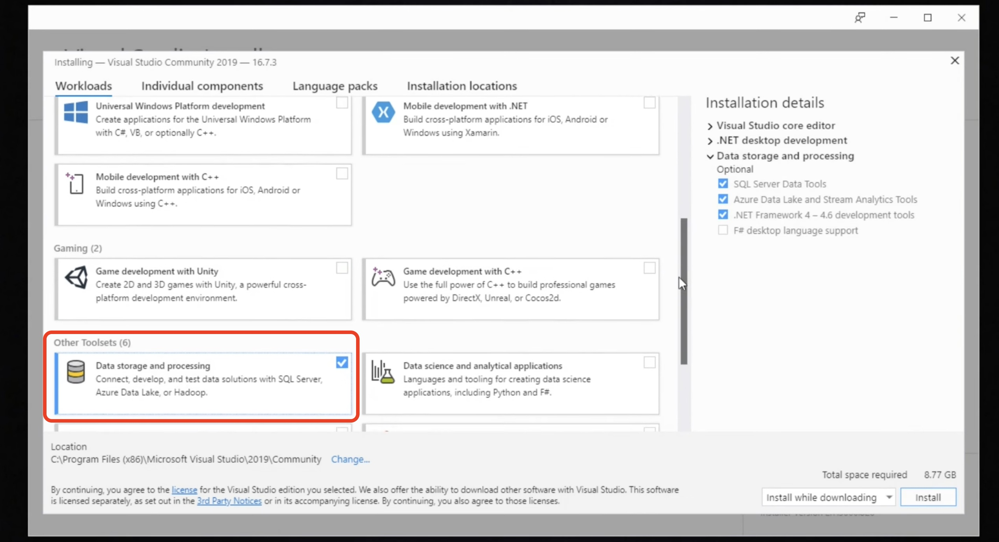

## Langkah Awal
Buka browser, kemudian search "download visual studio"

Setelah itu temen-temen pilih bagian _Community_ kemudian klik _Free download_

## Installasi
Kemudian temen-temen buka file yang sudah di download, lalu klik continue

Setelah di buka, maka akan muncul menu seperti di bawah ini. Kemudian pilih .Net desktop development. 
Karena kita hanya ingin membuat aplikasi desktop menggunakan C# maupun VB.Net. Sesuaikan tergantung kebutuhan kalian.

Kemudian kalian pilih bagian _Data storage and processing_, itu berfungsi untuk menghubungkan database _SQL Server_ ke dalam aplikasi 
desktop yang akan kita buat nanti.

