## Apa itu web ?

Sistem yang memungkinkan pengguna untuk mengakses informasi melalui
halaman-halaman yang terhubung secara elektronik, yang biasa disebut sebagai
situs web.

Informasi yang diberikan dibungkus ke dalam sebuah document Markup Language,
kemudian disimpan ke dalam server.

## Teknologi utama dalam web

### Client-side Scripting

- HTML (Hypertext Markup Language)
- CSS (Cascading Style Sheets)
- JavaScript

### Server-side Scripting

- PHP
- NodeJS
- Python

### API (Application Programming Interface)

- Memungkinkan berbagai aplikasi dan sistem untuk berkomunikasi satu sama lain
  melalui web

- Memungkinkan pengembang untuk mengintegrasikan fungsionalitas dari layanan
  pihak ketiga seperti peta, pembayaran, media sosial, dan masih banyak lagi ke
  dalam aplikasi web mereka.

### Cloud Computing

Hosting dan penyediaan infrastruktur untuk aplikasi web

## HTML

(Hypertext Markup Language)

### Struktur HTML

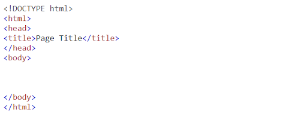

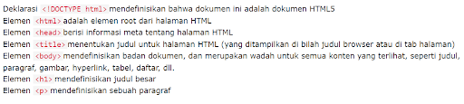

### Element HTML

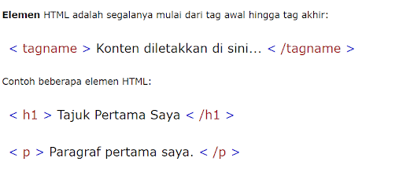

#### Blok dan inline

| Blok                                   | inline                                     |
| -------------------------------------- | ------------------------------------------ |
| 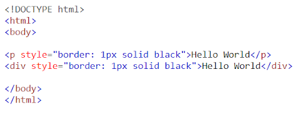 | 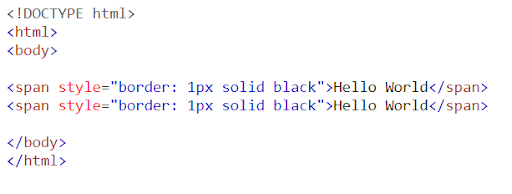 |
| 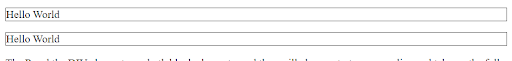 | 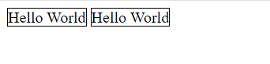 |
| 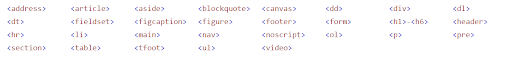 | 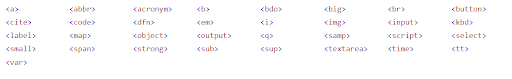 |
|                                        |                                            |

### Kategori Elemen HTML

- Metadata : Elemen-elemen yang memberikan informasi tentang halaman web,
  seperti judul, deskripsi dan metatag lainnya.

Contoh :

```html
<title> <meta> <link>
```

- Flow : Elemen-elemen yang biasanya digunakan untuk menyajikan konten utama
  halaman web.

Contoh :

```html
<p></p>
<div></div>
<span></span>
```

- Heading : Elemen-elemen yang digunakan untuk memberikan judul atau heading
  pada bagian halaman web.

Contoh :

```html
<h1></h1>
<h2></h2>
<h3></h3>
```

- Interactive : Elemen-elemen yang digunakan untuk memberikan judul atau heading
  pada bagian halaman web.

Contoh :

```html
<h1></h1>
<h2></h2>
<h3></h3>
```

- Embedded : Elemen-elemen yang digunakan untuk membuat interaksi dengan
  pengguna, seperti formulir atau tombol.

Contoh :

```html
<form></form>
<input />
<button></button>
```

### Link

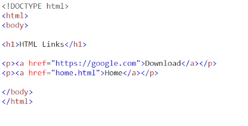

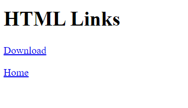

### Form

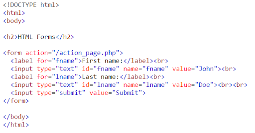

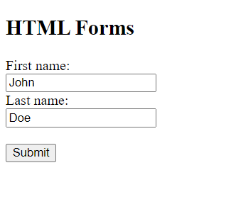

## Atribut HTML

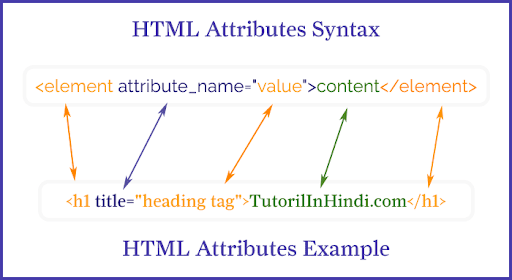

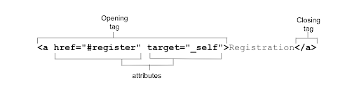

## Semantik HTML

Elemen semantik adalah elemen-elemen yang menyatakan makna atau tujuan dari
elemen itu sendiri.

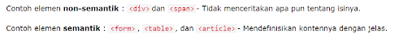

### Alasan menulis semantik

- Penggunaan elemen yang tepat

- Meningkatkan aksesibilitas

- Manfaat SEO

### Contoh elemen semanik

```html
<main></main>
<nav></nav>
<header></header>
<footer></footer>
<article></article>
```
