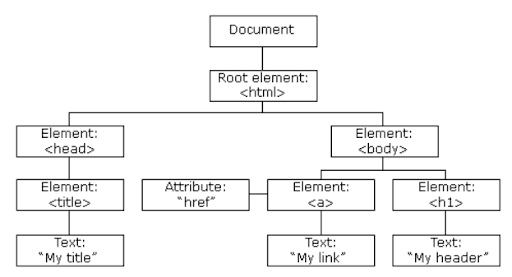

## Array

Tipe data yang mendeskripsikan kumpulan elemen (nilai dan variable), yang
tiap-tiap elemnnya memiliki index.

```js
var bulan = [“januari”, “februari”, “maret”, “April”]

```

| 0       | 1        | 2     | 3     |
| ------- | -------- | ----- | ----- |
| Januari | Februari | Maret | April |

```js
bulan[0]; // januari
bulan[3]; // april
```

### Array multidimensi

```js
var angka = [1, 2, , 3, 5, [100, 200, 300]];

bulan[4][1]; // 200
```

### Manipulasi array

```js
- Mengubah elemen array
var buah = [“apel”, “jeruk”, “mangga”]
buah[2] = “semangka”
// [‘apel’, ‘semangka’, ‘mangga’]

- Menambahkan elemen array
var buah = [“apel”, “jeruk”, “mangga”]
Buah.push(“semangka”)
// [‘apel’, ‘jeruk’, ‘mangga’, ‘semangka’]

- Mengahapus elemen
var buah = [“apel”, “jeruk”, “mangga”]
buah[2] = undefined
// [‘apel’, undefined, ‘mangga’]
```

### Method array

- Method .push() // menambah elemen di akhir (number, string, array dll)
- Method .push() // menambah elemen di awal (number, string, array dll)
- Method .pop() // menghapus elemen terakhir
- Method .shift() // menghapus elemen pertama
- Method .forEach() // melakukann pengulangan pada array
- Method .map() // membuat array baru sambil melakukan operasi terhadap elemen
  array
- Method .filter() // membuat array baru dengan memperhatikan kondisi tertentu
  pada setiap elemen array yang sudah ada
- Method .reduce() // berfungsi menjumlahkan elemen array dari kiri ke kanan

## Objects

> “in JavaScript, objects are king, if you understand objects, you understand
> JavaScript”

> “an objects is a collection of properties, and a property is an association
> between a name (or key) and a value”

> @POORCODERS

### Membuat object

```js
var person = {
  firstname : ‘lionel’,
  lastname : ‘messi’,
  age : 40
}

// {firstname : ‘lionel’, lastname : ‘messi’, age : 40}


objectname.properti/key        // person.age
or
objectname[‘key’]     // person[“age”]

var person = new Object()

person.firsname = ‘lionel’
person.lastname = ‘messi’
person.age = 40


// menambah dan menghapus properti
person.tinggi = ‘170 cm’
delete person.tinggi

```

## Document Object Model

Saat halaman web dimuat, browser membuat Model Objek Dokumen dari halaman
tersebut.



Dengan model objek, JavaScript mendapatkan semua kekuatan yang diperlukan untuk
membuat HTML dinamis:

- JavaScript dapat mengubah semua elemen HTML di halaman
- JavaScript dapat mengubah semua atribut HTML di halaman
- JavaScript dapat mengubah semua gaya CSS di halaman
- JavaScript dapat menghapus elemen dan atribut HTML yang ada
- JavaScript dapat menambahkan elemen dan atribut HTML baru
- JavaScript dapat bereaksi terhadap semua peristiwa HTML yang ada di halaman
- JavaScript dapat membuat acara HTML baru di halaman

Yang akan kita pelajari :

- Cara mengubah konten elemen HTML
- Cara mengubah gaya (CSS) elemen HTML
- Bagaimana bereaksi terhadap acara DOM HTML
- Bagaimana cara menambah dan menghapus elemen HTML

> "Model Objek Dokumen (DOM) adalah platform dan antarmuka bebas bahasa yang
> memungkinkan program dan skrip mengakses dan memperbarui konten, struktur, dan
> gaya dokumen secara dinamis.“

> ~ W3school ~

### Mengakses elemen

| Method                 | Ket                                                                |
| ---------------------- | ------------------------------------------------------------------ |
| getElementById()       | Memilih elemen berdasarkan attribute id                            |
| getElementsByTagName() | Memilih elemen berdarkan nama tag (return html collection)         |
| getElementsByClassName | Memilih elemen bersarkan nama kelas (return html collection)       |
| querySelector()        | Memilih elemen berdasarkan selector                                |
| querySelectorAll()     | Memilih semua elemen berdasarkan selector (return html collection) |

### Merubah elemen HTML

| Properti                            | Ket                             |
| ----------------------------------- | ------------------------------- |
| elemen.innerHTML = new html content | Merubah elemen HTML pada elemen |
| elemen.attribute = new value        | Merubah nilai attribute elemen  |
| elemen.style.property = new style   | Merubah style elemen            |

| Method                                | Ket                                                       |
| ------------------------------------- | --------------------------------------------------------- |
| elemen.setAttribute(attribute, value) | Membuat attribute atau merubah nilai attribute            |
| elemen.getAttribute(attribute)        | Mengambil nilai attribute                                 |
| elemen.removAttribute(attribute)      | Menghapus attribute                                       |
| elemen.classList.add()                | Menambah kelas pada elemen                                |
| elemen.classList.remove()             | Menghapus kelas pada elemen                               |
| elemen.classList.toggle()             | Menghapus kelas jika ada dan menambah kelas jika tdak ada |
| elemen.classList.replace(a, b)        | Mengganti nama kelas a menjadi b pada elemen              |

### DOM Events

Event pada javascript merepresentasikan sebuah kejadian yang terjadi di dalam
DOM, kejadian tersebut bisa dilakukan oleh user (mouse event, keyboard event,
dll) ataupun dilakukan secara otomatis oleh API (animasi selesai dijalankan,
halaman selesai diload, dll)

```js
- Mendengarkan Event
Event Handler (inline HTML attribute, elemen method)
	on<event>
- addEventListener()
```

### Event List

- Mouse Event
- Keyboard Event
- Resources Event
- Focus event
- View event
- Form event
- CSS Animation & Transition Event
- Drag & Drop Event
- dll
