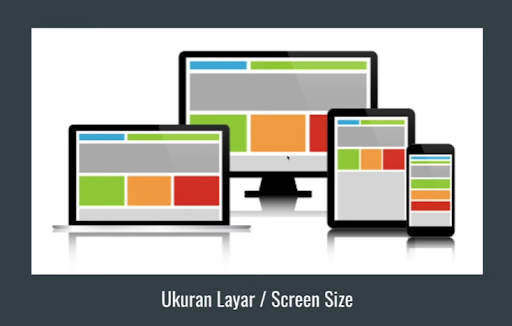
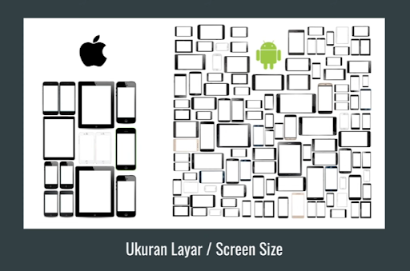
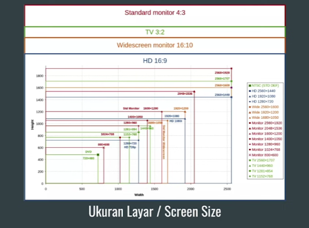
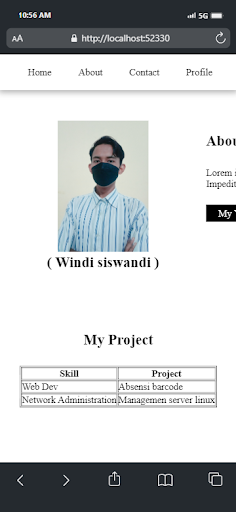
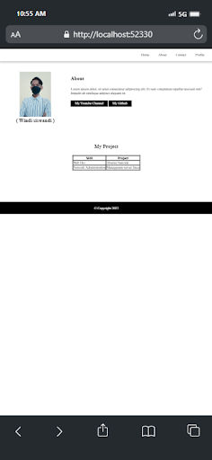
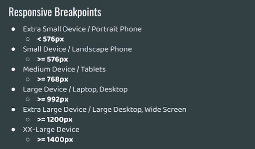
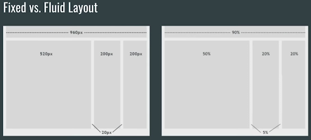
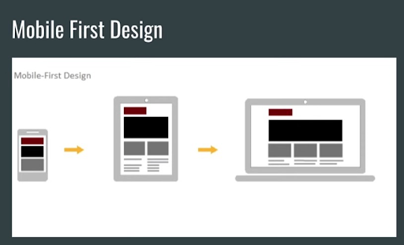
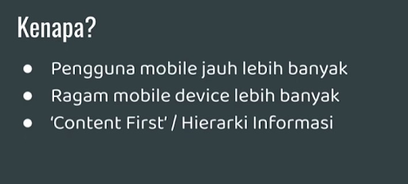

## Responsive Web Design

Sebuah pendekatan yang menyarankan agar proses perancangan dan pembangunan
sebuah web app harus merespon terhadap perilaku pengguna berdasarkan dari ukuran
layer, platform dan orientasi layer.







## Prinsip Responsive Web Design

### Viewport

```html
<meta name="viewport" content="width=device-width, initial-scale=1.0" />
```

| Viewport Meta Tag                               | Tanpa Viewport Meta Tag                                     |
| ----------------------------------------------- | ----------------------------------------------------------- |
|  |  |

### Breakpoint



### Media Query

```css
@media (min-width: 576px) {
}

@media (min-width: 768px) {
}

@media (min-width: 992px) {
}

@media (min-width: 1200px) {
}

@media (min-width: 1400px) {
}
```

### Fixed vs Fluid Layout



### Mobile First Design




